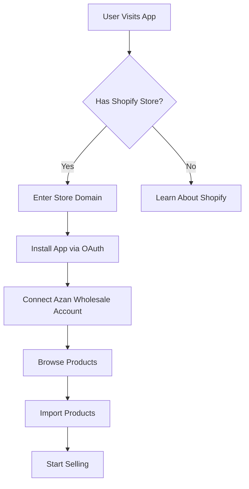

# 🌍 How to Make Your Azan Wholesale App Work for Others

## 📋 **Overview**

This guide explains how to transform your Azan Wholesale Shopify app from a single-store tool into a multi-tenant application that can serve thousands of Shopify merchants.

---

## 🎯 **Two Approaches to Distribution**

### **Option 1: Shopify App Store (Recommended)**
- ✅ Official distribution channel
- ✅ Built-in trust and credibility
- ✅ Automatic billing and payments
- ✅ Access to millions of merchants
- ❌ Requires Shopify approval
- ❌ Must follow strict guidelines

### **Option 2: Direct Distribution**
- ✅ No approval needed
- ✅ More flexibility
- ✅ Custom pricing
- ❌ Manual user management
- ❌ Less trust and discoverability

---

## 🚀 **Option 1: Shopify App Store Implementation**

### **Step 1: Become a Shopify Partner**

```bash
1. Go to https://www.shopify.com/partners
2. Sign up for free account
3. Complete your profile
4. Verify your email
5. Access Partner Dashboard
```

### **Step 2: Create Your App Listing**

#### **App Information**
```
App Name: Azan Wholesale Dropshipping
App URL: https://your-app-domain.com
Redirect URL: https://your-app-domain.com/api/auth/callback

Webhook URLs:
- https://your-app-domain.com/api/webhooks/orders (orders/create, orders/updated)
```

#### **Required Permissions**
```javascript
const REQUIRED_SCOPES = [
  'read_products',      // Read product data
  'write_products',     // Create/update products
  'read_orders',        // Process orders
  'read_inventory',     // Read inventory levels
  'write_inventory'     // Update inventory levels
]
```

### **Step 3: Implement Multi-Tenant Architecture**

#### **Database Schema (if you add one)**
```sql
-- Shops table
CREATE TABLE shops (
  id SERIAL PRIMARY KEY,
  shopify_domain VARCHAR(255) UNIQUE NOT NULL,
  shopify_token VARCHAR(255) NOT NULL,
  shop_name VARCHAR(255),
  shop_email VARCHAR(255),
  plan_type VARCHAR(50) DEFAULT 'free',
  created_at TIMESTAMP DEFAULT CURRENT_TIMESTAMP,
  updated_at TIMESTAMP DEFAULT CURRENT_TIMESTAMP
);

-- User configurations
CREATE TABLE user_configs (
  id SERIAL PRIMARY KEY,
  shop_id INTEGER REFERENCES shops(id),
  azan_app_id VARCHAR(255) NOT NULL,
  azan_secret_key VARCHAR(255) NOT NULL,
  created_at TIMESTAMP DEFAULT CURRENT_TIMESTAMP,
  updated_at TIMESTAMP DEFAULT CURRENT_TIMESTAMP
);

-- Import history
CREATE TABLE import_history (
  id SERIAL PRIMARY KEY,
  shop_id INTEGER REFERENCES shops(id),
  product_id INTEGER NOT NULL,
  product_name VARCHAR(255),
  import_date TIMESTAMP DEFAULT CURRENT_TIMESTAMP,
  status VARCHAR(50) DEFAULT 'success'
);
```

#### **Update API Routes for Multi-Tenancy**
```typescript
// /src/app/api/import/route.ts
export async function POST(request: NextRequest) {
  const { shopifyDomain, productId, customPrice } = await request.json()
  
  // Get shop configuration from database
  const shop = await getShopByDomain(shopifyDomain)
  const config = await getUserConfig(shop.id)
  
  // Use shop-specific credentials
  const apiClient = axios.create({
    baseURL: 'https://beta.azanwholesale.com',
    headers: {
      'App-ID': config.azan_app_id,
      'Secret-Key': config.azan_secret_key
    }
  })
  
  // Import product to shop's Shopify store
  const shopifyResponse = await axios.post(
    `https://${shopifyDomain}/admin/api/2024-01/products.json`,
    productData,
    {
      headers: {
        'X-Shopify-Access-Token': shop.shopify_token
      }
    }
  )
}
```

### **Step 4: Update Frontend for Multi-Shop Support**

#### **Shop Detection and Authentication**
```typescript
// /src/app/page.tsx
export default function Home() {
  const [shop, setShop] = useState('')
  const [isAuthenticated, setIsAuthenticated] = useState(false)
  
  useEffect(() => {
    // Check if coming from Shopify OAuth
    const urlParams = new URLSearchParams(window.location.search)
    const shopParam = urlParams.get('shop')
    const success = urlParams.get('success')
    
    if (shopParam) {
      setShop(shopParam)
      if (success === 'true') {
        setIsAuthenticated(true)
      }
    }
  }, [])
  
  const handleShopifyAuth = () => {
    if (!shop) return
    
    // Redirect to Shopify OAuth
    window.location.href = `/api/auth?shop=${shop}`
  }
}
```

### **Step 5: Implement Billing (Optional)**

#### **Shopify Billing Integration**
```typescript
// /src/app/api/billing/route.ts
export async function POST(request: NextRequest) {
  const { shop, plan } = await request.json()
  
  // Create recurring charge
  const chargeData = {
    recurring_application_charge: {
      name: "Azan Wholesale Pro Plan",
      price: 29.99,
      return_url: `${process.env.NEXT_PUBLIC_APP_URL}/billing/callback`,
      test: process.env.NODE_ENV === 'development'
    }
  }
  
  const response = await axios.post(
    `https://${shop}/admin/api/2024-01/recurring_application_charges.json`,
    chargeData,
    {
      headers: {
        'X-Shopify-Access-Token': shopToken
      }
    }
  )
  
  return NextResponse.json({
    confirmation_url: response.data.recurring_application_charge.confirmation_url
  })
}
```

---

## 🚀 **Option 2: Direct Distribution**

### **Step 1: Create User Management System**

#### **Simple User Registration**
```typescript
// /src/app/api/users/route.ts
export async function POST(request: NextRequest) {
  const { email, password, shopifyDomain } = await request.json()
  
  // Create user account
  const user = await createUser({
    email,
    password: await hashPassword(password),
    shopify_domain: shopifyDomain,
    plan: 'free'
  })
  
  // Send welcome email with setup instructions
  await sendWelcomeEmail(email, shopifyDomain)
  
  return NextResponse.json({ success: true, userId: user.id })
}
```

### **Step 2: Create Installation Guide**

#### **Manual Installation Instructions**
```markdown
# Azan Wholesale App - Manual Installation

## Step 1: Create Custom App in Shopify
1. Go to your Shopify Admin
2. Click "Settings" → "Apps and sales channels"
3. Click "Develop apps for your store"
4. Click "Create an app"
5. Name it "Azan Wholesale"
6. Configure "Admin API integration" with these scopes:
   - read_products
   - write_products
   - read_orders
   - read_inventory
   - write_inventory

## Step 2: Get API Credentials
1. After creating the app, click "API credentials"
2. Copy the "Admin API access token"
3. Note your store's domain (e.g., your-store.myshopify.com)

## Step 3: Configure in Azan Wholesale App
1. Go to https://your-app-domain.com
2. Enter your Shopify store domain
3. Enter the Admin API access token
4. Enter your Azan Wholesale credentials
5. Start importing products!
```

### **Step 3: Create Landing Page**

#### **Marketing Landing Page**
```typescript
// /src/app/landing/page.tsx
export default function Landing() {
  return (
    <div className="min-h-screen bg-gradient-to-br from-blue-50 to-indigo-100">
      <div className="container mx-auto px-4 py-16">
        <div className="text-center mb-16">
          <h1 className="text-5xl font-bold text-gray-900 mb-6">
            Azan Wholesale for Shopify
          </h1>
          <p className="text-xl text-gray-600 mb-8 max-w-3xl mx-auto">
            Import thousands of wholesale products directly to your Shopify store. 
            No inventory, no hassle, just profit.
          </p>
          <div className="flex gap-4 justify-center">
            <Button size="lg" onClick={() => router.push('/signup')}>
              Get Started Free
            </Button>
            <Button variant="outline" size="lg">
              View Demo
            </Button>
          </div>
        </div>
        
        <div className="grid md:grid-cols-3 gap-8 mb-16">
          <FeatureCard
            icon={Package}
            title="10,000+ Products"
            description="Access our extensive catalog of wholesale products"
          />
          <FeatureCard
            icon={DollarSign}
            title="Competitive Pricing"
            description="Wholesale prices that maximize your profit margins"
          />
          <FeatureCard
            icon={Zap}
            title="One-Click Import"
            description="Import products to Shopify in seconds, not hours"
          />
        </div>
      </div>
    </div>
  )
}
```

---

## 🎯 **Making It Work for Others - Key Components**

### **1. User Onboarding Flow**



### **2. Multi-Tenant Data Isolation**

```typescript
// Middleware to ensure data isolation
export async function withShopAuth(request: NextRequest, handler: Function) {
  const shopDomain = request.headers.get('x-shopify-shop-domain')
  
  if (!shopDomain) {
    return NextResponse.json({ error: 'Unauthorized' }, { status: 401 })
  }
  
  // Get shop-specific configuration
  const shop = await getShopByDomain(shopDomain)
  if (!shop) {
    return NextResponse.json({ error: 'Shop not found' }, { status: 404 })
  }
  
  // Add shop context to request
  request.shop = shop
  
  return handler(request)
}
```

### **3. Scalable Architecture**

#### **Load Balancing**
```bash
# Use multiple server instances
pm2 start server.js -i max

# Or use container orchestration
docker-compose up --scale app=3
```

#### **Database Connection Pooling**
```typescript
// Use connection pooling for database
const pool = new Pool({
  connectionString: process.env.DATABASE_URL,
  max: 20, // Maximum number of connections
  idleTimeoutMillis: 30000,
  connectionTimeoutMillis: 2000,
})
```

### **4. Monitoring and Analytics**

#### **User Analytics**
```typescript
// Track user actions
export async function trackEvent(shopId: string, event: string, data: any) {
  await analytics.track({
    userId: shopId,
    event,
    properties: data,
    timestamp: new Date()
  })
}

// Usage examples
await trackEvent(shopId, 'product_imported', { productId: 123 })
await trackEvent(shopId, 'order_processed', { orderId: 456 })
```

---

## 📊 **Business Model Options**

### **Option A: Free + Wholesale Margin**
- ✅ Easy to get users
- ✅ You earn from product margins
- ❌ Revenue depends on sales volume

### **Option B: Subscription Model**
```javascript
const PLANS = {
  free: {
    price: 0,
    products: 10,
    features: ['Basic import', 'Email support']
  },
  pro: {
    price: 29.99,
    products: 'unlimited',
    features: ['Unlimited imports', 'Priority support', 'Advanced analytics']
  },
  enterprise: {
    price: 99.99,
    products: 'unlimited',
    features: ['Everything in Pro', 'API access', 'Dedicated support']
  }
}
```

### **Option C: Freemium Model**
- Free for first 10 products
- $9.99/month for up to 100 products
- $29.99/month for unlimited products

### **Option D: Pay-per-Import**
- $0.10 per product imported
- Or 1% of product value
- No monthly fees

---

## 🚀 **Launch Strategy**

### **Phase 1: Beta Testing (2-4 weeks)**
- Invite 10-20 trusted merchants
- Collect feedback and fix bugs
- Test different pricing models
- Build case studies

### **Phase 2: Soft Launch (1-2 months)**
- Open to 100-500 merchants
- Refine onboarding process
- Optimize performance
- Gather testimonials

### **Phase 3: Full Launch**
- Submit to Shopify App Store
- Marketing campaign
- PR and outreach
- Scale infrastructure

### **Phase 4: Growth**
- Add new features
- Expand to other platforms
- Build partner program
- International expansion

---

## 🎯 **Success Metrics**

### **User Acquisition**
- Number of active shops
- Installation conversion rate
- User retention rate
- Customer acquisition cost

### **Revenue Metrics**
- Monthly recurring revenue (MRR)
- Average revenue per user (ARPU)
- Customer lifetime value (LTV)
- Churn rate

### **Product Metrics**
- Products imported per shop
- Order processing success rate
- API response times
- Error rates

---

## 🆘 **Common Challenges and Solutions**

### **Challenge 1: API Rate Limits**
```typescript
// Implement rate limiting
import rateLimit from 'express-rate-limit'

const limiter = rateLimit({
  windowMs: 15 * 60 * 1000, // 15 minutes
  max: 100, // limit each IP to 100 requests per windowMs
  message: 'Too many requests from this IP'
})

app.use('/api/', limiter)
```

### **Challenge 2: Data Consistency**
```typescript
// Implement data validation
const productSchema = z.object({
  name: z.string().min(1).max(255),
  price: z.number().positive(),
  sku: z.string().min(1),
  stock: z.number().int().min(0)
})

export async function validateProduct(data: any) {
  return productSchema.parse(data)
}
```

### **Challenge 3: Security**
```typescript
// Implement proper authentication
export async function verifyShopifyRequest(request: NextRequest) {
  const hmac = request.headers.get('x-shopify-hmac-sha256')
  const topic = request.headers.get('x-shopify-topic')
  
  // Verify HMAC signature
  const isValid = verifyHmac(request, hmac)
  if (!isValid) {
    throw new Error('Invalid HMAC signature')
  }
  
  return true
}
```

---

## 🎉 **Next Steps**

### **Immediate Actions (This Week)**
1. Deploy app to Vercel/AWS
2. Test with real Azan Wholesale credentials
3. Create Shopify Partner account
4. Prepare app store assets

### **Short-term Goals (1 Month)**
1. Implement multi-tenant architecture
2. Add user management system
3. Create landing page
4. Start beta testing

### **Medium-term Goals (3 Months)**
1. Submit to Shopify App Store
2. Implement billing system
3. Add analytics dashboard
4. Scale infrastructure

### **Long-term Goals (6-12 Months)**
1. Reach 1000+ active shops
2. Expand to other e-commerce platforms
3. Add advanced features
4. Build partner ecosystem

---

Ready to make your app available to the world? Start with Phase 1 and work your way through the launch strategy!